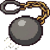

# blackout-env

PettingZoo Parallel environment wrapper for the BlackOut Unity ML-Agents game.

## Game Overview

BlackOut is a 2-team competitive game. Each team controls 5 units on a procedurally generated 24×24 grid map, collecting **Batteries** and depositing them into storage to accumulate score. Every 20 seconds a **storage absorption** event permanently locks in battery score — but until then, enemies can raid your storage and steal items. First team to 100 points or the highest score after 7 minutes wins.

For full game rules see [docs/gameplay_en.md](docs/gameplay_en.md) / [docs/gameplay_ko.md](docs/gameplay_ko.md).

## Table of Contents

- [Getting Started](#getting-started)
  - [Local Installation](#local-installation)
  - [Docker (GPU Training)](#docker-gpu-training)
- [Usage](#usage)
- [Observation Space](#observation-space)
- [Competition](#competition)
  - [Observation](#observation)
  - [Action](#action)
  - [Step 1: Define your policy](#step-1-define-your-policy-policypy)
  - [Step 2: Save a checkpoint](#step-2-save-a-checkpoint)
  - [Step 3: Run a match](#step-3-run-a-match)
  - [Different architectures per team](#different-architectures-per-team)
  - [Implementing BaseModel directly (optional)](#implementing-basemodel-directly-optional)
- [Utilities](#utilities)

---

## Getting Started

### Local Installation

**Python 3.10.x required.** (`mlagents-envs 1.1.0` does not support 3.11+)

> **Note:** `mlagents-envs 1.1.0` declares a `pettingzoo==1.15.0` dependency that conflicts with
> blackout-env's requirement of `pettingzoo>=1.24.0`. Since `mlagents-envs` does not actually import
> pettingzoo at runtime, install it with `--no-deps` first, then install blackout-env normally.

#### Windows — uv

```powershell
# Install uv (if not already installed)
powershell -ExecutionPolicy ByPass -c "irm https://astral.sh/uv/install.ps1 | iex"

# Run from the repo root (where pyproject.toml is)
uv venv blackout --python 3.10
blackout\Scripts\activate
uv pip install "mlagents-envs==1.1.0" --no-deps
uv pip install .
```

#### Linux — uv

```bash
curl -LsSf https://astral.sh/uv/install.sh | sh

# Run from the repo root (where pyproject.toml is)
uv venv blackout --python 3.10
source blackout/bin/activate
pip install "mlagents-envs==1.1.0" --no-deps
pip install .
```

#### conda

```bash
# Run from the repo root (where pyproject.toml is)
conda create -n blackout python=3.10.12
conda activate blackout
pip install "mlagents-envs==1.1.0" --no-deps
pip install .
```

#### PyTorch

PyTorch is required for training and competition. Install it separately according to your CUDA version — see [pytorch.org/get-started/locally](https://pytorch.org/get-started/locally/) for the right command.

```bash
# Example: CUDA 11.8
pip install torch --index-url https://download.pytorch.org/whl/cu118
```

### Docker (GPU Training)

#### Prerequisites

- [Docker](https://docs.docker.com/engine/install/)
- [NVIDIA Container Toolkit](https://docs.nvidia.com/datacenter/cloud-native/container-toolkit/install-guide.html) (for GPU passthrough)

#### 1. Download and extract the Unity Linux build

Download `blackout_linux_build_x86_64.zip` from the [Releases page](../../releases) and extract it:

```bash
unzip blackout_linux_build_x86_64.zip -d ~/blackout_build
chmod +x ~/blackout_build/blackout_linux_build.x86_64
```

#### 2. Configure the build path

Open `docker-compose.yml` and set the Unity build path under `volumes:`:

```yaml
volumes:
  - /path/to/blackout_build:/unity_build:ro
```

#### 3. Build the image

```bash
docker compose build
```

#### 4. Run

Set `command:` in `docker-compose.yml` to your training script, then:

```bash
docker compose up -d blackout-trainer
docker compose logs -f blackout-trainer  # optional: stream training logs
```

Inside the container the build is at `/unity_build`:

```python
env = BlackOutEnv(
    env_path="/unity_build/blackout_linux_build.x86_64",
)
```

---

## Usage

`semantic_map_config.json` is the config file shared with Unity's StreamingAssets. A default copy is bundled with the package, so `semantic_config_path` is optional. Pass it explicitly only if you need to override the defaults.

The config must include:

```json
{
    "resolution_scale": 4,
    "item_id_offset": 6,
    "n_items": 5,
    "n_classes": 3,
    "ids": {
        "empty": 0,
        "wall": 1,
        "ally_storage": 2,
        "enemy_storage": 3,
        "ally_unit": 4,
        "enemy_unit": 5
    }
}
```

```python
from blackout_env import BlackOutEnv, SemanticId, team_of, team_a_agents

env = BlackOutEnv(
    env_path="path/to/BlackOut.exe",  # None = connect to running Unity Editor
    # semantic_config_path defaults to the bundled config; override if needed:
    # semantic_config_path="path/to/semantic_map_config.json",
)

obs, infos = env.reset()

while env.agents:
    actions = {agent: env.action_space(agent).sample() for agent in env.agents}
    obs, rewards, terminations, truncations, infos = env.step(actions)

env.close()
```

### Seeding

Pass `seed` to `reset()` to make map generation and item placement reproducible.
The seed is sent to Unity via a SideChannel before each episode begins, so `UnityEngine.Random` is initialized before `OnEpisodeBegin` runs.

```python
obs, infos = env.reset(seed=42)   # reproducible episode
obs, infos = env.reset(seed=42)   # identical map/item layout
obs, infos = env.reset(seed=99)   # different layout
obs, infos = env.reset()          # unseeded — random layout
```

---

## Observation Space

Each agent receives a dict observation:

| Key | Shape | Description |
|---|---|---|
| `"vector"` | `float32[N]` | Preprocessed vector obs (positions, scores, one-hot items/classes) |
| `"graphic"` | `float32[H × W × C]` | Binary channel masks from semantic ID map |

### Graphic channels (`float32[H, W, C]`)

Each channel is a binary 0.0 / 1.0 mask:

| Channel | Name | `SemanticId` constant |
|---|---|---|
| 0 | empty space | `SemanticId.EMPTY` |
| 1 | wall | `SemanticId.WALL` |
| 2 | ally storage | `SemanticId.ALLY_STORAGE` |
| 3 | enemy storage | `SemanticId.ENEMY_STORAGE` |
| 4 | ally unit | `SemanticId.ALLY_UNIT` |
| 5 | enemy unit | `SemanticId.ENEMY_UNIT` |
| 6 | Battery | `SemanticId.BATTERY` |
| 7 | BuffSpeed | `SemanticId.BUFF_SPEED` |
| 8 | DebuffSpeed | `SemanticId.DEBUFF_SPEED` |
| 9 | BuffSize | `SemanticId.BUFF_SIZE` |
| 10 | DebuffSize | `SemanticId.DEBUFF_SIZE` |

### Items

Effects are active as long as the **item** sits in storage. Removing or stealing the item immediately cancels the effect.

| | Item | Effect | Target |
|---|---|---|---|
|  | **Battery** | Grants points equal to item amount on deposit; permanently locked in on absorption | — |
|  | **BuffSpeed** | Speed +50% while this item is in allied storage | All ally units |
|  | **DebuffSpeed** | Speed −90% while this item is in allied storage | Enemy Worker units only |
|  | **BuffSize** | Size +50% while this item is in allied storage | All ally units |
|  | **DebuffSize** | Size −30% while this item is in allied storage | All enemy units |

---

## Competition

Each participant submits two files:

1. **`policy.py`** — `nn.Module` implementation (model architecture)
2. **`checkpoint.pt`** — trained weights

### Observation

Each agent receives:

```python
obs[agent] = {
    "vector": np.ndarray,  # float32[N] — positions, scores, one-hot items/classes
    "graphic": np.ndarray,  # float32[H, W, C] — semantic channel masks
}
```

#### vector layout (`float32[N]`)

`N = 10*(2+1+(n_items+1)) + n_classes + 3`

Units are ordered unit_0~9 (all agents, sorted by agent_id), interleaved:

| Offset within each unit block | Length | Description |
|---|---|---|
| unit_i: pos | 2 | pos_x, pos_y (normalized) |
| unit_i: team_sign | 1 | ally +1.0, enemy −1.0 |
| unit_i: holding_item one-hot | `n_items+1` | index 0 = no item, index i = holding item i |

Followed by:

| Segment | Length | Description |
|---|---|---|
| class one-hot | `n_classes` | this agent's unit class |
| scalars | 3 | own_score, opp_score, time_left (all in 0~1) |

#### graphic layout (`float32[H, W, C]`)

Each channel is a binary 0.0 / 1.0 mask:

| Channel | Semantic | `SemanticId` constant |
|---|---|---|
| 0 | empty space | `SemanticId.EMPTY` |
| 1 | wall | `SemanticId.WALL` |
| 2 | ally storage | `SemanticId.ALLY_STORAGE` |
| 3 | enemy storage | `SemanticId.ENEMY_STORAGE` |
| 4 | ally unit | `SemanticId.ALLY_UNIT` |
| 5 | enemy unit | `SemanticId.ENEMY_UNIT` |
| 6 | Battery | `SemanticId.BATTERY` |
| 7 | BuffSpeed | `SemanticId.BUFF_SPEED` |
| 8 | DebuffSpeed | `SemanticId.DEBUFF_SPEED` |
| 9 | BuffSize | `SemanticId.BUFF_SIZE` |
| 10 | DebuffSize | `SemanticId.DEBUFF_SIZE` |

### Action

`float32[2]` — `(dx, dy)` in `[-1, 1]` per agent.

### Step 1: Define your policy (`policy.py`)

Subclass `nn.Module` with `forward(vector, graphic) → action`:

```python
# policy.py
import torch
import torch.nn as nn

class MyPolicy(nn.Module):
    """
    Input:
        vector : (B, N)         float32
        graphic : (B, C, H, W)   float32  — CHW order (blackout-env converts automatically)
    Output:
        action : (B, 2)         float32  — (dx, dy) in [-1, 1]
    """
    def __init__(self, vector_size: int, n_channels: int):
        super().__init__()
        self.cnn = nn.Sequential(
            nn.Conv2d(n_channels, 16, 3, padding=1), nn.ReLU(),
            nn.Conv2d(16, 32, 3, padding=1), nn.ReLU(),
            nn.AdaptiveAvgPool2d((4, 4)),
        )
        self.mlp = nn.Sequential(
            nn.Linear(32 * 4 * 4 + vector_size, 256), nn.ReLU(),
            nn.Linear(256, 2),
            nn.Tanh(),
        )

    def forward(self, vector: torch.Tensor, graphic: torch.Tensor) -> torch.Tensor:
        cnn_out = self.cnn(graphic).flatten(1)
        return self.mlp(torch.cat([vector, cnn_out], dim=1))
```

> **Note:** `graphic` is expected in `(B, C, H, W)` format.  
> blackout-env automatically converts the environment output from `(B, H, W, C)`.

### Step 2: Save a checkpoint

```python
torch.save({"policy_state": model.state_dict()}, "checkpoint.pt")

# Or as a raw state dict (pass state_dict_key=None when loading)
torch.save(model.state_dict(), "checkpoint.pt")
```

### Step 3: Run a match

```python
import json
from blackout_env import BlackOutEnv, load_checkpoint, run_match, run_series
from policy import MyPolicy  # each participant's policy file

# derive observation sizes from config
cfg = json.load(open("semantic_map_config.json"))
n_items = cfg["n_items"]
n_classes = cfg["n_classes"]
vector_size = 10 * (2 + 1 + (n_items + 1)) + n_classes + 3
n_channels = 6 + n_items

# load models
model_a = load_checkpoint(
    MyPolicy,
    "team_a/checkpoint.pt",
    state_dict_key="policy_state",   # None if raw state dict
    device="cuda",
    vector_size=vector_size,
    n_channels=n_channels,
)
model_b = load_checkpoint(
    MyPolicy,
    "team_b/checkpoint.pt",
    state_dict_key="policy_state",
    device="cuda",
    vector_size=vector_size,
    n_channels=n_channels,
)

# create environment
env = BlackOutEnv(
    env_path="path/to/BlackOut.x86_64",
)

# single match
result = run_match(env, model_a, model_b)
print(f"Winner: {'A' if result.winner == 0 else 'B' if result.winner == 1 else 'Draw'}")

# best-of-10 series (sides swap each match)
series = run_series(env, model_a, model_b, n_matches=10)
print(f"A wins: {series.model_a_wins}, B wins: {series.model_b_wins}, Draws: {series.draws}")

env.close()
```

### Different architectures per team

Each participant can use a different model architecture. Load each team's `policy.py` dynamically:

```python
import importlib.util

def load_policy_class(policy_path: str, class_name: str = "MyPolicy"):
    spec = importlib.util.spec_from_file_location("policy", policy_path)
    module = importlib.util.module_from_spec(spec)
    spec.loader.exec_module(module)
    return getattr(module, class_name)

PolicyA = load_policy_class("team_a/policy.py")
PolicyB = load_policy_class("team_b/policy.py")

model_a = load_checkpoint(PolicyA, "team_a/checkpoint.pt", vector_size=..., n_channels=...)
model_b = load_checkpoint(PolicyB, "team_b/checkpoint.pt", vector_size=..., n_channels=...)
```

### Implementing BaseModel directly (optional)

For custom batching or inference logic, subclass `BaseModel` directly:

```python
from blackout_env import BaseModel
import numpy as np
import torch

class MyModel(BaseModel):
    def __init__(self, checkpoint_path: str):
        from policy import MyPolicy
        net = MyPolicy(vector_size=96, n_channels=11)
        ckpt = torch.load(checkpoint_path, weights_only=True)
        net.load_state_dict(ckpt["policy_state"])
        net.eval()
        self._net = net

    def act(self, obs: dict[str, dict[str, np.ndarray]]) -> dict[str, np.ndarray]:
        agents = list(obs.keys())
        vectors = torch.tensor(
            np.stack([obs[a]["vector"] for a in agents]), dtype=torch.float32
        )
        graphics = torch.tensor(
            np.stack([obs[a]["graphic"] for a in agents]), dtype=torch.float32
        ).permute(0, 3, 1, 2)  # (B,H,W,C) → (B,C,H,W)

        with torch.no_grad():
            actions = self._net(vectors, graphics).clamp(-1, 1).numpy()
        return {agent: actions[i] for i, agent in enumerate(agents)}
```

> `load_checkpoint` implements this pattern internally via `CheckpointModel`.  
> Only subclass `BaseModel` directly if you need custom preprocessing or ensembling.

---

## Utilities

```python
from blackout_env import SemanticId, team_of, team_a_agents, team_b_agents

# Split obs by team
a_obs = {k: v for k, v in obs.items() if team_of(k) == 0}

# Index into graphic obs by semantic channel
wall_mask  = graphic[:, :, SemanticId.WALL]
ally_units = graphic[:, :, SemanticId.ALLY_UNIT]
item0      = graphic[:, :, SemanticId.item_channel(0)]
```
